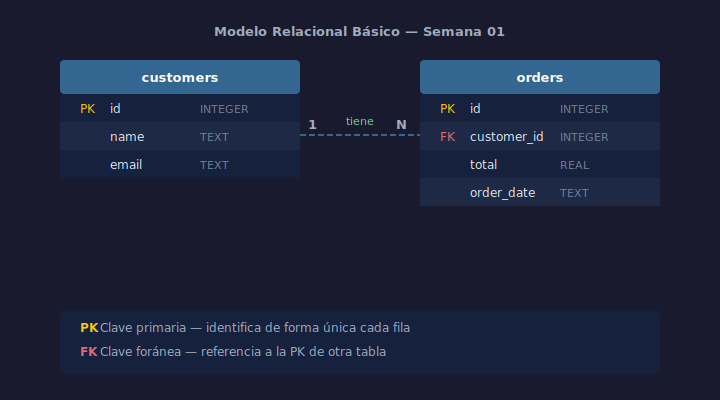

# 01 — Qué es una Base de Datos Relacional

## Objetivos

- Entender qué problema resuelve una base de datos
- Conocer el modelo relacional y sus conceptos clave
- Distinguir una BD relacional de otras formas de almacenar datos

## Diagrama



## 1. El problema que resuelve

Antes de las bases de datos, los sistemas guardaban información en archivos de
texto o hojas de cálculo. El problema: datos duplicados, inconsistentes y
difíciles de consultar.

Una **base de datos relacional** organiza la información en **tablas** que se
relacionan entre sí, eliminando duplicados y garantizando consistencia.

## 2. El modelo relacional

Propuesto por Edgar Codd en 1970, el modelo relacional se basa en tres ideas:

- Los datos se almacenan en **tablas** (también llamadas relaciones)
- Cada tabla tiene **columnas** (atributos) y **filas** (registros)
- Las tablas se vinculan mediante **claves** (llaves)

## 3. SGBD: el motor que gestiona los datos

Un **Sistema Gestor de Bases de Datos (SGBD)** es el software que permite
crear, consultar y administrar una BD relacional.

Ejemplos populares:

| SGBD       | Uso típico                        |
| ---------- | --------------------------------- |
| SQLite     | Apps móviles, desarrollo local    |
| PostgreSQL | Producción, análisis de datos     |
| MySQL      | Aplicaciones web                  |

> En este bootcamp usamos **SQLite** para las semanas 1–12, y
> **PostgreSQL 16** para las semanas 13–24.

## 4. Tu entorno de trabajo

Para los ejercicios de esta semana necesitas SQLite instalado:

```bash
# Linux / macOS
sqlite3 --version

# Windows — descargar desde https://www.sqlite.org/download.html
```

Para abrir una base de datos nueva:

```bash
sqlite3 mi_primera_bd.db
```

## Checklist

- [ ] ¿Puedes explicar qué problema resuelve una base de datos relacional?
- [ ] ¿Sabes diferenciar tabla, fila y columna?
- [ ] ¿Tienes SQLite instalado y funcionando?
- [ ] ¿Entiendes por qué usamos SQLite y no PostgreSQL ahora?

## Referencias

- [SQLite — Documentación oficial](https://www.sqlite.org/docs.html)
- [Edgar Codd y el modelo relacional — Wikipedia](https://es.wikipedia.org/wiki/Base_de_datos_relacional)
