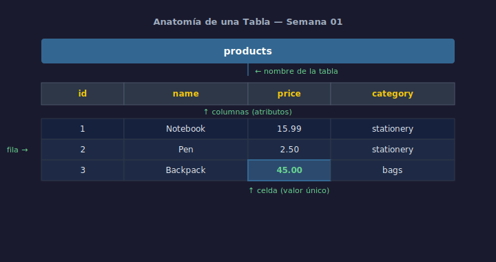

# 02 — Tablas, Filas, Columnas y Tipos de Datos

## Objetivos

- Identificar las partes de una tabla relacional
- Conocer los tipos de datos más comunes en SQL
- Leer un diagrama ER básico

## Diagrama



## 1. Anatomía de una tabla

Una tabla es una cuadrícula con estructura fija:

```
┌─────────────────────────────────────────┐
│              products                   │  ← nombre de la tabla
├────┬──────────────┬───────┬─────────────┤
│ id │     name     │ price │  category   │  ← columnas (atributos)
├────┼──────────────┼───────┼─────────────┤
│  1 │ Notebook     │ 15.99 │ stationery  │  ← fila (registro)
│  2 │ Pen          │  2.50 │ stationery  │  ← fila (registro)
│  3 │ Backpack     │ 45.00 │ bags        │  ← fila (registro)
└────┴──────────────┴───────┴─────────────┘
```

- **Tabla**: agrupa datos del mismo tipo de entidad
- **Columna**: define un atributo (nombre, tipo, restricciones)
- **Fila**: un registro individual con valores concretos
- **Celda**: intersección de fila y columna — un valor único

## 2. Tipos de datos básicos en SQLite

SQLite usa un sistema de tipos flexible llamado *type affinity*:

| Tipo      | Uso                              | Ejemplo            |
| --------- | -------------------------------- | ------------------ |
| `INTEGER` | Números enteros                  | `42`, `-5`, `0`    |
| `REAL`    | Números decimales                | `3.14`, `99.99`    |
| `TEXT`    | Cadenas de texto                 | `'Alice'`, `'MX'`  |
| `BLOB`    | Datos binarios (imágenes, etc.)  | —                  |
| `NULL`    | Ausencia de valor                | —                  |

## 3. Cómo se crean las tablas (adelanto del DDL)

```sql
-- Tabla de productos con tipos de datos
CREATE TABLE products (
    id       INTEGER,
    name     TEXT,
    price    REAL,
    category TEXT
);
```

> El DDL (`CREATE TABLE`, `ALTER TABLE`, etc.) se estudia en detalle en
> la **Semana 02**.

## 4. La clave primaria

Cada fila necesita un identificador único: la **clave primaria** (`PRIMARY KEY`).

```sql
-- La columna id identifica de forma única cada producto
CREATE TABLE products (
    id       INTEGER PRIMARY KEY,
    name     TEXT,
    price    REAL
);
```

## Checklist

- [ ] ¿Puedes nombrar las 4 partes de una tabla relacional?
- [ ] ¿Sabes qué tipo de dato usar para un precio? ¿Y para un nombre?
- [ ] ¿Para qué sirve la clave primaria?
- [ ] ¿Qué pasa si dos filas tienen el mismo `id`?

## Referencias

- [SQLite Datatypes](https://www.sqlite.org/datatype3.html)
- [W3Schools — SQL Data Types](https://www.w3schools.com/sql/sql_datatypes.asp)
