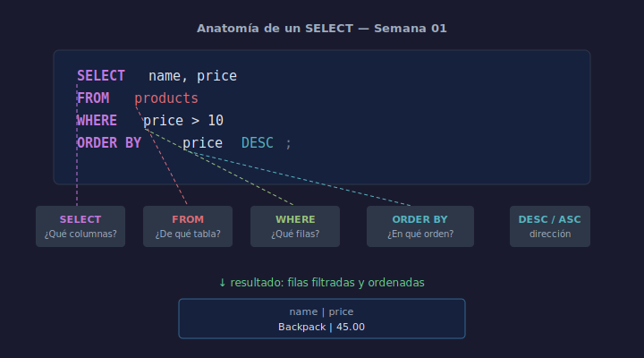

# 03 — Tu Primera Consulta SELECT

## Objetivos

- Comprender la estructura básica de una consulta SQL
- Usar `SELECT`, `FROM`, `WHERE` y `ORDER BY`
- Seleccionar columnas específicas en lugar de `SELECT *`

## Diagrama



## 1. Estructura de un SELECT

```sql
SELECT columna1, columna2
FROM   nombre_tabla
WHERE  condicion
ORDER BY columna1;
```

Cada cláusula tiene un rol:

| Cláusula   | Pregunta que responde          |
| ---------- | ------------------------------ |
| `SELECT`   | ¿Qué columnas quiero ver?      |
| `FROM`     | ¿De qué tabla?                 |
| `WHERE`    | ¿Qué filas me interesan?       |
| `ORDER BY` | ¿En qué orden quiero el resultado? |

## 2. Tu primer SELECT

```sql
-- Obtener todos los productos
SELECT id, name, price
FROM   products;
```

> Evita `SELECT *` en código de producción — siempre lista columnas explícitas.

## 3. Filtrar con WHERE

```sql
-- Productos con precio mayor a 10
SELECT name, price
FROM   products
WHERE  price > 10;
```

```sql
-- Productos de la categoría 'stationery'
SELECT name, price
FROM   products
WHERE  category = 'stationery';
```

## 4. Ordenar con ORDER BY

```sql
-- Productos ordenados por precio de menor a mayor
SELECT name, price
FROM   products
ORDER BY price ASC;

-- Productos ordenados por nombre de Z a A
SELECT name, price
FROM   products
ORDER BY name DESC;
```

## Checklist

- [ ] ¿Sabes por qué no usar `SELECT *` en producción?
- [ ] ¿Puedes escribir un `SELECT` con `WHERE` y `ORDER BY`?
- [ ] ¿Sabes la diferencia entre `ASC` y `DESC`?
- [ ] ¿Qué pasa si omites el `WHERE`?

## Referencias

- [SQLite SELECT](https://www.sqlite.org/lang_select.html)
- [W3Schools — SQL SELECT](https://www.w3schools.com/sql/sql_select.asp)
