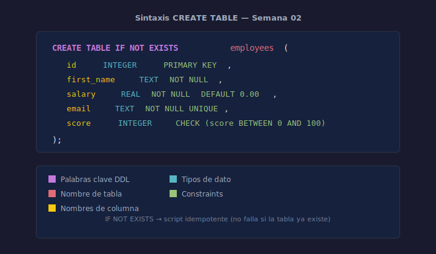

# 01 — CREATE TABLE: Sintaxis y Convenciones

## Objetivos

- Escribir un `CREATE TABLE` completo con tipos de datos y clave primaria
- Usar `IF NOT EXISTS` para scripts idempotentes
- Aplicar las convenciones de nomenclatura del bootcamp

## Diagrama



## 1. Sintaxis básica

```sql
CREATE TABLE IF NOT EXISTS table_name (
    column_name  data_type  [constraints],
    ...
);
```

`IF NOT EXISTS` evita errores si la tabla ya existe. Úsalo siempre en scripts.

## 2. Tipos de datos en SQLite

| Tipo      | Uso                         | Ejemplo de valor |
| --------- | --------------------------- | ---------------- |
| `INTEGER` | Números enteros             | `42`, `-1`       |
| `REAL`    | Números decimales           | `9.99`, `3.14`   |
| `TEXT`    | Cadenas de texto            | `'Alice'`        |
| `BLOB`    | Datos binarios              | imágenes         |
| `NULL`    | Ausencia de valor           | —                |

## 3. Ejemplo completo

```sql
-- Tabla de empleados con columnas y tipos de datos
CREATE TABLE IF NOT EXISTS employees (
    id         INTEGER PRIMARY KEY,
    first_name TEXT    NOT NULL,
    last_name  TEXT    NOT NULL,
    salary     REAL    NOT NULL DEFAULT 0.00,
    hire_date  TEXT    NOT NULL
);
```

## 4. Convenciones de nomenclatura

- Tablas: **plural**, snake_case en inglés → `employees`, `order_items`
- Columnas: snake_case en inglés → `first_name`, `hire_date`
- Clave primaria: `id` o `<tabla_singular>_id` → `employee_id`
- Clave foránea: `<tabla_singular>_id` → `department_id`

## Checklist

- [ ] ¿Usas `IF NOT EXISTS` en cada `CREATE TABLE`?
- [ ] ¿Los nombres de tablas están en plural y en inglés?
- [ ] ¿La clave primaria tiene `INTEGER PRIMARY KEY`?
- [ ] ¿Los tipos de datos son apropiados para cada columna?

## Referencias

- [SQLite CREATE TABLE](https://www.sqlite.org/lang_createtable.html)
- [W3Schools — SQL CREATE TABLE](https://www.w3schools.com/sql/sql_create_table.asp)
