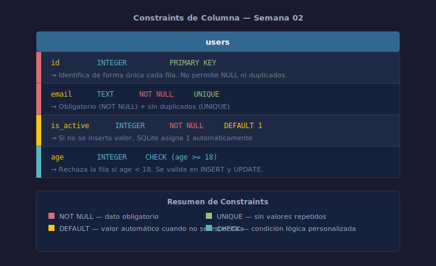

# 02 — Constraints: NOT NULL, DEFAULT, UNIQUE, CHECK

## Objetivos

- Aplicar las 4 constraints de columna más usadas en diseño de esquemas
- Entender cuándo usar cada constraint
- Combinar constraints en una misma columna

## Diagrama



## 1. NOT NULL

Impide que una columna acepte valores nulos. Úsala cuando el dato es siempre obligatorio.

```sql
-- email es obligatorio; no puede insertarse una fila sin él
CREATE TABLE IF NOT EXISTS users (
    id    INTEGER PRIMARY KEY,
    email TEXT    NOT NULL
);
```

## 2. DEFAULT

Asigna un valor automático cuando no se provee el dato en el `INSERT`.

```sql
-- Si no se especifica is_active, se asume 1 (activo)
CREATE TABLE IF NOT EXISTS products (
    id        INTEGER PRIMARY KEY,
    name      TEXT    NOT NULL,
    is_active INTEGER NOT NULL DEFAULT 1
);
```

## 3. UNIQUE

Garantiza que no haya dos filas con el mismo valor en esa columna.

```sql
-- No pueden existir dos usuarios con el mismo email
CREATE TABLE IF NOT EXISTS users (
    id    INTEGER PRIMARY KEY,
    email TEXT    NOT NULL UNIQUE
);
```

## 4. CHECK

Valida que el valor cumpla una condición lógica antes de insertarlo.

```sql
-- El precio debe ser mayor a 0; el stock no puede ser negativo
CREATE TABLE IF NOT EXISTS products (
    id    INTEGER PRIMARY KEY,
    price REAL    NOT NULL CHECK (price > 0),
    stock INTEGER NOT NULL DEFAULT 0 CHECK (stock >= 0)
);
```

## 5. Combinando constraints

Las constraints se encadenan después del tipo de dato:

```sql
CREATE TABLE IF NOT EXISTS employees (
    id         INTEGER PRIMARY KEY,
    email      TEXT    NOT NULL UNIQUE,
    salary     REAL    NOT NULL DEFAULT 0 CHECK (salary >= 0),
    department TEXT    NOT NULL DEFAULT 'general'
);
```

## Checklist

- [ ] ¿Sabes cuándo una columna debe ser `NOT NULL`?
- [ ] ¿Pusiste `DEFAULT` en columnas con un valor lógico por defecto?
- [ ] ¿Usas `UNIQUE` para campos irrepetibles como emails o códigos?
- [ ] ¿Tu `CHECK` cubre los valores inválidos posibles?

## Referencias

- [SQLite Constraints](https://www.sqlite.org/lang_createtable.html#constraints)
- [W3Schools — SQL Constraints](https://www.w3schools.com/sql/sql_constraints.asp)
