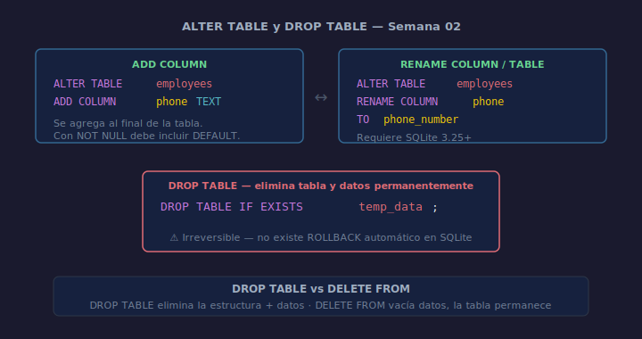

# 03 — ALTER TABLE y DROP TABLE

## Objetivos

- Agregar y renombrar columnas con `ALTER TABLE`
- Eliminar tablas con `DROP TABLE`
- Conocer las limitaciones de `ALTER TABLE` en SQLite

## Diagrama



## 1. ALTER TABLE — Agregar columna

Agrega una nueva columna a una tabla existente. La columna se agrega al final.

```sql
-- Agregar columna phone a la tabla employees
ALTER TABLE employees
ADD COLUMN phone TEXT;
```

> Si la columna tiene `NOT NULL`, debe incluir `DEFAULT` para las filas existentes.

```sql
-- Correcto: NOT NULL con DEFAULT para filas existentes
ALTER TABLE employees
ADD COLUMN is_active INTEGER NOT NULL DEFAULT 1;
```

## 2. ALTER TABLE — Renombrar columna y tabla

```sql
-- Renombrar columna (SQLite 3.25+)
ALTER TABLE employees
RENAME COLUMN phone TO phone_number;

-- Renombrar la tabla completa
ALTER TABLE employees
RENAME TO staff;
```

## 3. DROP TABLE

Elimina la tabla y todos sus datos permanentemente.

```sql
-- Eliminar tabla solo si existe (evita error)
DROP TABLE IF EXISTS temp_data;
```

> ⚠️ `DROP TABLE` es irreversible. En SQLite no existe `TRUNCATE` —
> usa `DELETE FROM table_name;` para vaciar una tabla sin eliminarla.

## 4. Limitaciones de SQLite con ALTER TABLE

A diferencia de PostgreSQL, SQLite **no soporta**:
- `ALTER TABLE ... DROP COLUMN` (antes de SQLite 3.35)
- `ALTER TABLE ... MODIFY COLUMN`
- `ALTER TABLE ... ADD CONSTRAINT`

Para cambios mayores en SQLite se recrea la tabla:
`CREATE TABLE new → INSERT SELECT → DROP old → RENAME new`.

## Checklist

- [ ] ¿Sabes cuándo usar `ADD COLUMN` vs recrear la tabla?
- [ ] ¿Usas `DROP TABLE IF EXISTS` para evitar errores?
- [ ] ¿Conoces la diferencia entre `DROP TABLE` y `DELETE FROM`?
- [ ] ¿Sabes por qué `NOT NULL` sin `DEFAULT` falla en `ALTER TABLE`?

## Referencias

- [SQLite ALTER TABLE](https://www.sqlite.org/lang_altertable.html)
- [SQLite DROP TABLE](https://www.sqlite.org/lang_droptable.html)
