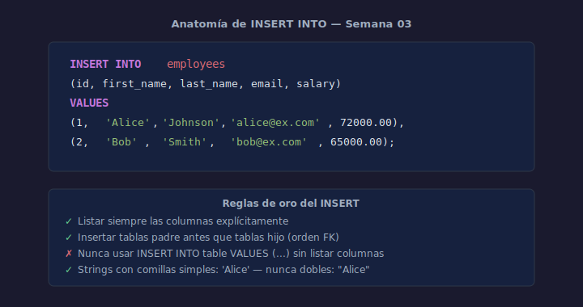

# 01 — INSERT INTO: Insertar Datos

## Objetivos

- Insertar una fila con `INSERT INTO ... VALUES`
- Insertar múltiples filas en una sola instrucción
- Respetar constraints al insertar

## Diagrama



## 1. Insertar una fila

```sql
-- Insertar un departamento
INSERT INTO departments (id, name)
VALUES (1, 'engineering');
```

Listar siempre las columnas explícitamente — nunca depender del orden de la tabla.

## 2. Insertar múltiples filas

```sql
-- Insertar varios empleados en una sola instrucción
INSERT INTO employees (id, first_name, last_name, email, salary)
VALUES
    (1, 'Alice',  'Johnson', 'alice@example.com',  72000.00),
    (2, 'Bob',    'Smith',   'bob@example.com',    65000.00),
    (3, 'Carlos', 'Rivera',  'carlos@example.com', 58000.00);
```

## 3. INSERT con columnas opcionales

Si una columna tiene `DEFAULT` o admite `NULL`, puedes omitirla:

```sql
-- is_active toma DEFAULT 1 automáticamente
INSERT INTO employees (id, first_name, last_name, email)
VALUES (4, 'Diana', 'Lee', 'diana@example.com');
```

## 4. Errores comunes al insertar

- Violar `NOT NULL`: insertar sin valor en columna obligatoria → error
- Violar `UNIQUE`: insertar email duplicado → error
- Violar `CHECK`: insertar salary negativo → error
- Violar `FOREIGN KEY`: referenciar un `id` que no existe → error

## Checklist

- [ ] ¿Listas siempre las columnas en el `INSERT`?
- [ ] ¿Tus datos respetan todos los constraints de la tabla?
- [ ] ¿Usas comillas simples para valores `TEXT`?
- [ ] ¿Insertas primero las tablas padre antes que las tablas hijo (FK)?

## Referencias

- [SQLite INSERT](https://www.sqlite.org/lang_insert.html)
- [W3Schools — SQL INSERT INTO](https://www.w3schools.com/sql/sql_insert.asp)
