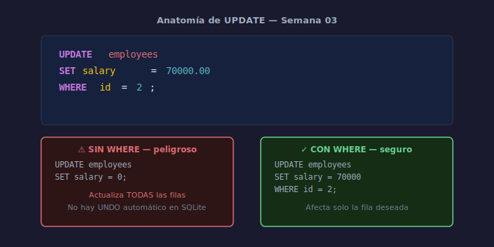

# 02 — UPDATE: Actualizar Registros

## Objetivos

- Actualizar una o varias columnas con `UPDATE ... SET`
- Filtrar las filas afectadas con `WHERE`
- Evitar el error más común: `UPDATE` sin `WHERE`

## Diagrama



## 1. Sintaxis básica

```sql
UPDATE table_name
SET    column1 = value1,
       column2 = value2
WHERE  condition;
```

> ⚠️ Sin `WHERE`, **todas las filas** de la tabla se actualizan.

## 2. Actualizar una fila por su PK

```sql
-- Actualizar el salario del empleado con id = 2
UPDATE employees
SET    salary = 70000.00
WHERE  id = 2;
```

Filtrar siempre por la clave primaria cuando se quiere afectar una sola fila.

## 3. Actualizar múltiples columnas

```sql
-- Actualizar nombre y email en una sola instrucción
UPDATE employees
SET    first_name = 'Roberto',
       email      = 'roberto@example.com'
WHERE  id = 3;
```

## 4. Actualizar múltiples filas

```sql
-- Dar aumento del 10% a todos los del departamento 1
UPDATE employees
SET    salary = salary * 1.10
WHERE  department_id = 1;
```

## Checklist

- [ ] ¿Tu `UPDATE` siempre incluye una cláusula `WHERE`?
- [ ] ¿Verificaste con `SELECT` qué filas afectará antes de ejecutar?
- [ ] ¿Actualizas solo las columnas necesarias, no toda la fila?
- [ ] ¿El nuevo valor respeta los constraints de la columna?

## Referencias

- [SQLite UPDATE](https://www.sqlite.org/lang_update.html)
- [W3Schools — SQL UPDATE](https://www.w3schools.com/sql/sql_update.asp)
