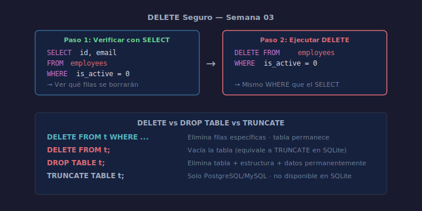

# 03 — DELETE: Eliminar Registros de Forma Segura

## Objetivos

- Eliminar filas específicas con `DELETE FROM ... WHERE`
- Distinguir entre `DELETE`, `DROP TABLE` y `TRUNCATE`
- Aplicar la regla: verificar antes de borrar

## Diagrama



## 1. Sintaxis básica

```sql
DELETE FROM table_name
WHERE  condition;
```

> ⚠️ Sin `WHERE`, **todas las filas** se eliminan. La tabla permanece vacía.

## 2. Eliminar una fila por PK

```sql
-- Eliminar el empleado con id = 5
DELETE FROM employees
WHERE  id = 5;
```

## 3. Eliminar con condición compuesta

```sql
-- Eliminar empleados inactivos del departamento 2
DELETE FROM employees
WHERE  is_active = 0
  AND  department_id = 2;
```

## 4. Verificar antes de borrar

Buena práctica: ejecutar el `SELECT` equivalente antes del `DELETE`:

```sql
-- Paso 1: verificar qué filas se borrarán
SELECT id, first_name, email
FROM   employees
WHERE  is_active = 0;

-- Paso 2: solo si el resultado es correcto, ejecutar el DELETE
DELETE FROM employees
WHERE  is_active = 0;
```

## 5. DELETE vs DROP TABLE vs TRUNCATE

| Operación      | Qué hace                                  | Recuperable |
| -------------- | ----------------------------------------- | ----------- |
| `DELETE`       | Elimina filas específicas                 | Con tx      |
| `DROP TABLE`   | Elimina la tabla completa + datos         | No          |
| `TRUNCATE`*    | Vacía la tabla rápidamente                | No          |

> *`TRUNCATE` no existe en SQLite. Se usa `DELETE FROM table;` sin `WHERE`.

## Checklist

- [ ] ¿Tu `DELETE` siempre incluye `WHERE`?
- [ ] ¿Verificaste con `SELECT` las filas afectadas antes de borrar?
- [ ] ¿Sabes la diferencia entre `DELETE` y `DROP TABLE`?
- [ ] ¿Tienes en cuenta el orden de borrado cuando hay FK?

## Referencias

- [SQLite DELETE](https://www.sqlite.org/lang_delete.html)
- [W3Schools — SQL DELETE](https://www.w3schools.com/sql/sql_delete.asp)
