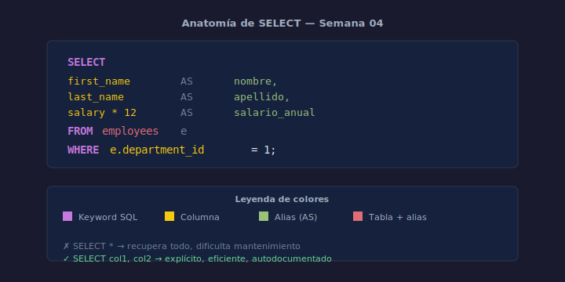

# SELECT y FROM

## Objetivos
- Recuperar columnas específicas evitando `SELECT *`
- Asignar alias descriptivos con `AS`
- Usar expresiones calculadas en el `SELECT`

## Diagrama



## 1. Sintaxis básica

```sql
SELECT columna1, columna2
FROM   tabla;
```

Siempre lista las columnas que necesitas. `SELECT *` recupera todo y
dificulta el mantenimiento.

## 2. Alias de columna

```sql
SELECT
    first_name                       AS nombre,
    last_name                        AS apellido,
    salary * 12                      AS salario_anual
FROM employees;
```

`AS` renombra la columna en el resultado. También se puede omitir `AS` pero
incluirlo mejora la legibilidad.

## 3. Alias de tabla

```sql
SELECT
    e.first_name,
    e.salary
FROM employees e;
```

Una letra o abreviatura como alias de tabla hace las consultas más concisas,
especialmente con JOINs (Semana 09).

## 4. Expresiones y funciones

```sql
SELECT
    first_name || ' ' || last_name   AS full_name,
    UPPER(email)                     AS email_upper
FROM employees;
```

SQLite usa `||` para concatenar strings; `UPPER()` convierte a mayúsculas.

## Checklist

- [ ] ¿Listaste columnas explícitas en lugar de `SELECT *`?
- [ ] ¿Usaste alias con `AS` para columnas calculadas?
- [ ] ¿El alias de tabla es corto y descriptivo?
- [ ] ¿Verificaste que la consulta se ejecuta sin error?

## Referencias

- https://www.sqlite.org/lang_select.html
- https://www.w3schools.com/sql/sql_select.asp
