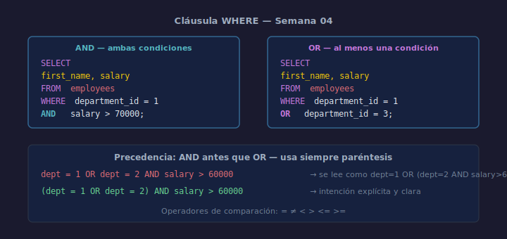

# WHERE: Filtrar filas

## Objetivos
- Filtrar filas con condiciones de igualdad y comparación
- Combinar condiciones con `AND` y `OR`
- Entender la precedencia de operadores lógicos

## Diagrama



## 1. Comparación simple

```sql
SELECT first_name, salary
FROM   employees
WHERE  department_id = 1;
```

Operadores disponibles: `=`, `!=` (o `<>`), `<`, `>`, `<=`, `>=`.

## 2. Condiciones múltiples con AND y OR

```sql
-- AND: ambas condiciones deben ser verdaderas
SELECT first_name, salary
FROM   employees
WHERE  department_id = 1
  AND  salary > 70000;

-- OR: al menos una condición es verdadera
SELECT first_name, salary
FROM   employees
WHERE  department_id = 1
  OR   department_id = 3;
```

## 3. Precedencia: AND se evalúa antes que OR

```sql
-- Sin paréntesis — puede dar resultados inesperados
WHERE  dept = 1 OR dept = 2 AND salary > 60000

-- Con paréntesis — intención clara
WHERE  (dept = 1 OR dept = 2) AND salary > 60000
```

Usa **siempre** paréntesis cuando combines `AND` y `OR`.

## 4. NOT

```sql
SELECT first_name
FROM   employees
WHERE  NOT department_id = 2;
```

## Checklist

- [ ] ¿Usaste el operador correcto (`=` vs `!=` vs `<` etc.)?
- [ ] ¿Añadiste paréntesis al combinar AND y OR?
- [ ] ¿Verificaste que el filtro devuelve las filas esperadas?
- [ ] ¿Evitaste `WHERE 1=1` sin propósito?

## Referencias

- https://www.sqlite.org/lang_expr.html
- https://mode.com/sql-tutorial/sql-where/
