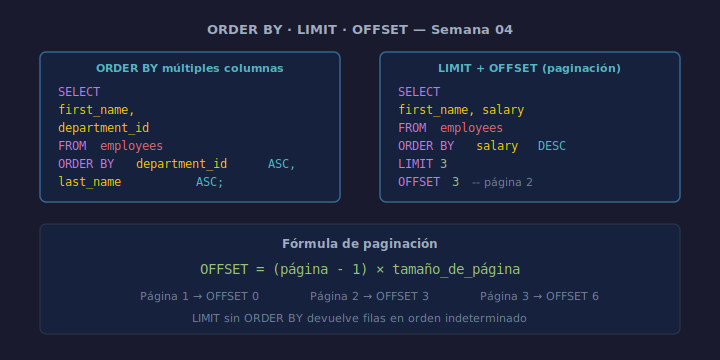

# ORDER BY, LIMIT y OFFSET

## Objetivos
- Ordenar resultados de forma ascendente y descendente
- Limitar el número de filas devueltas con `LIMIT`
- Implementar paginación básica con `OFFSET`

## Diagrama



## 1. ORDER BY

```sql
SELECT first_name, salary
FROM   employees
ORDER BY salary DESC;
```

`ASC` (por defecto) ordena de menor a mayor; `DESC` de mayor a menor.

## 2. Ordenar por múltiples columnas

```sql
SELECT first_name, last_name, department_id
FROM   employees
ORDER BY department_id ASC,
         last_name     ASC;
```

SQLite aplica el orden de izquierda a derecha: primero por `department_id`,
luego por `last_name` dentro de cada departamento.

## 3. LIMIT

```sql
-- Devuelve los 3 empleados con mayor salario
SELECT first_name, salary
FROM   employees
ORDER BY salary DESC
LIMIT 3;
```

`LIMIT` sin `ORDER BY` devuelve filas en orden indeterminado. Úsalos juntos.

## 4. OFFSET — paginación

```sql
-- Página 2 de 3 resultados por página
SELECT first_name, salary
FROM   employees
ORDER BY salary DESC
LIMIT  3
OFFSET 3;
```

`OFFSET n` salta las primeras `n` filas. Página = (número_página - 1) × tamaño.

## Checklist

- [ ] ¿Usaste `ORDER BY` junto a `LIMIT`?
- [ ] ¿Verificaste que `OFFSET` apunta a la página correcta?
- [ ] ¿El orden es el esperado (ASC o DESC)?
- [ ] ¿Evitaste `SELECT *` en la consulta paginada?

## Referencias

- https://www.sqlite.org/lang_select.html#limitoffset
- https://www.w3schools.com/sql/sql_orderby.asp
