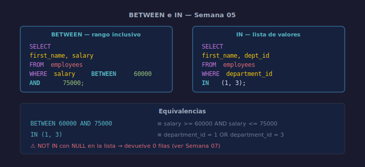

# BETWEEN e IN

## Objetivos
- Filtrar rangos de valores con `BETWEEN`
- Comparar contra listas de valores con `IN` y `NOT IN`
- Elegir entre `OR` encadenado y `IN` para mayor claridad

## Diagrama



## 1. BETWEEN

```sql
-- Empleados con salario entre 60000 y 75000 (ambos inclusive)
SELECT first_name, salary
FROM   employees
WHERE  salary BETWEEN 60000 AND 75000;
```

`BETWEEN a AND b` equivale a `>= a AND <= b`. Los límites son **inclusivos**.

## 2. NOT BETWEEN

```sql
SELECT first_name, salary
FROM   employees
WHERE  salary NOT BETWEEN 60000 AND 75000;
```

## 3. IN

```sql
-- Empleados de los departamentos 1 o 3
SELECT first_name, department_id
FROM   employees
WHERE  department_id IN (1, 3);
```

Más legible que: `WHERE department_id = 1 OR department_id = 3`.

## 4. NOT IN

```sql
SELECT first_name, department_id
FROM   employees
WHERE  department_id NOT IN (2);
```

> ⚠️ `NOT IN` con valores `NULL` en la lista devuelve 0 filas. Se aborda
> con detalle en la Semana 07.

## Checklist

- [ ] ¿Verificaste que los límites de BETWEEN son los esperados (ambos inclusive)?
- [ ] ¿Usaste IN en lugar de múltiples OR para mejorar legibilidad?
- [ ] ¿La lista de IN no contiene NULLs sin querer?
- [ ] ¿El resultado de NOT IN es el complemento esperado?

## Referencias

- https://www.sqlite.org/lang_expr.html#between
- https://www.w3schools.com/sql/sql_between.asp
