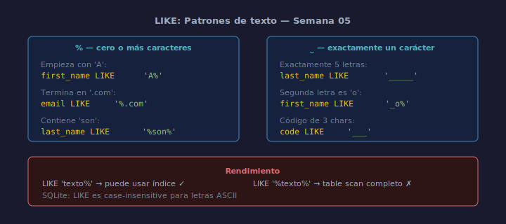

# LIKE: Coincidencia de Patrones

## Objetivos
- Buscar textos que empiezan, terminan o contienen una subcadena
- Usar `%` (cero o más caracteres) y `_` (un carácter exacto)
- Conocer las limitaciones de LIKE en rendimiento

## Diagrama



## 1. Comodín %

```sql
-- Nombres que empiezan con 'A'
SELECT first_name FROM employees WHERE first_name LIKE 'A%';

-- Emails de dominio company.com
SELECT email FROM employees WHERE email LIKE '%@company.com';

-- Cualquier texto que contenga 'son'
SELECT last_name FROM employees WHERE last_name LIKE '%son%';
```

`%` representa cero o más caracteres en cualquier posición.

## 2. Comodín _

```sql
-- Apellidos de exactamente 5 letras
SELECT last_name FROM employees WHERE last_name LIKE '_____';

-- Emails cuyo primer carácter es 'a' seguido de cualquier cosa
SELECT email FROM employees WHERE email LIKE 'a_%';
```

Cada `_` representa **un solo carácter** obligatorio.

## 3. NOT LIKE

```sql
SELECT email
FROM   employees
WHERE  email NOT LIKE '%@company.com';
```

## 4. Rendimiento

`LIKE '%texto'` (empieza con `%`) no puede usar índices y hace un
escaneo completo de la tabla. En textos grandes, usa FTS (Full Text Search).

## Checklist

- [ ] ¿Usaste `%` para subcadenas y `_` para posición exacta?
- [ ] ¿El patrón distingue mayúsculas? (SQLite es case-insensitive para ASCII)
- [ ] ¿Evitaste `LIKE '%texto%'` en columnas grandes sin índice FTS?
- [ ] ¿Verificaste que NOT LIKE produce el resultado esperado?

## Referencias

- https://www.sqlite.org/lang_expr.html#like
- https://www.w3schools.com/sql/sql_like.asp
