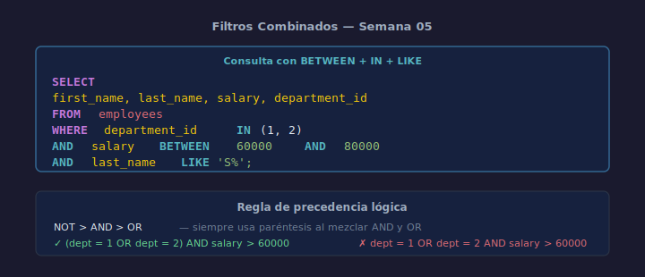

# Filtros Combinados

## Objetivos
- Combinar BETWEEN, IN y LIKE en una sola consulta
- Usar NOT con cualquier operador de filtro
- Escribir filtros complejos de forma legible

## Diagrama



## 1. Combinar operadores

```sql
-- Empleados del depto 1 o 2, con salario entre 60k y 80k
SELECT first_name, salary, department_id
FROM   employees
WHERE  department_id IN (1, 2)
  AND  salary BETWEEN 60000 AND 80000;
```

## 2. Combinar LIKE con otros operadores

```sql
-- Empleados cuyo nombre empieza con 'A' y salario > 70000
SELECT first_name, salary
FROM   employees
WHERE  first_name LIKE 'A%'
  AND  salary > 70000;
```

## 3. Uso de NOT y paréntesis

```sql
-- Empleados fuera del rango y sin email de dominio externo
SELECT first_name, email, salary
FROM   employees
WHERE  salary NOT BETWEEN 60000 AND 70000
  AND  email NOT LIKE '%@external.com';
```

## 4. Orden de legibilidad recomendado

Coloca el filtro más restrictivo primero (aunque el motor puede reordenar):

```sql
SELECT first_name, last_name, salary
FROM   employees
WHERE  department_id IN (1, 3)      -- filtro de cardinalidad baja primero
  AND  salary BETWEEN 65000 AND 80000
  AND  last_name LIKE 'S%';
```

## Checklist

- [ ] ¿Usaste paréntesis cuando hay AND y OR mezclados?
- [ ] ¿El orden de los filtros refleja la intención del negocio?
- [ ] ¿Verificaste el resultado con un `SELECT COUNT(*)` previo?
- [ ] ¿Cada condición tiene el operador más apropiado?

## Referencias

- https://www.sqlite.org/lang_expr.html
- https://mode.com/sql-tutorial/sql-where/
