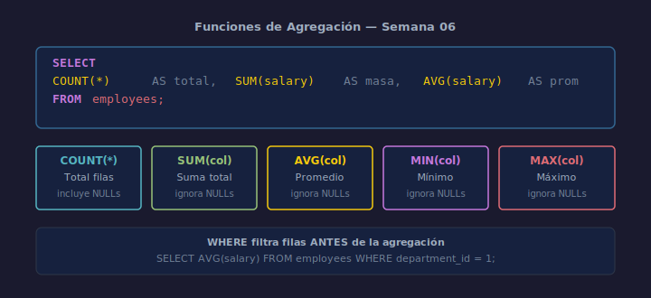

# Funciones de Agregación

## Objetivos
- Calcular conteos, sumas, promedios y extremos sobre conjuntos de filas
- Entender que las funciones de agregación ignoran NULLs (excepto COUNT(*))
- Combinar agregación con WHERE para filtrar antes de agregar

## Diagrama



## 1. COUNT

```sql
-- Total de empleados en la tabla
SELECT COUNT(*) AS total_empleados FROM employees;

-- Empleados que tienen email registrado (ignora NULLs)
SELECT COUNT(email) AS con_email FROM employees;
```

`COUNT(*)` cuenta todas las filas. `COUNT(columna)` excluye NULLs.

## 2. SUM y AVG

```sql
SELECT
    SUM(salary) AS masa_salarial,
    AVG(salary) AS salario_promedio
FROM employees;
```

## 3. MIN y MAX

```sql
SELECT
    MIN(salary) AS salario_minimo,
    MAX(salary) AS salario_maximo
FROM employees;
```

## 4. Combinando con WHERE

```sql
-- Promedio solo del departamento 1
SELECT AVG(salary) AS promedio_depto1
FROM   employees
WHERE  department_id = 1;
```

`WHERE` filtra las filas **antes** de que se aplique la agregación.

## Checklist

- [ ] ¿Usaste `COUNT(*)` para contar filas y `COUNT(col)` cuando importan NULLs?
- [ ] ¿Verificaste que AVG devuelve el tipo esperado (REAL en SQLite)?
- [ ] ¿El WHERE aplica antes de la agregación?
- [ ] ¿Cada función lleva un alias descriptivo?

## Referencias

- https://www.sqlite.org/lang_aggfunc.html
- https://www.w3schools.com/sql/sql_count_avg_sum.asp
