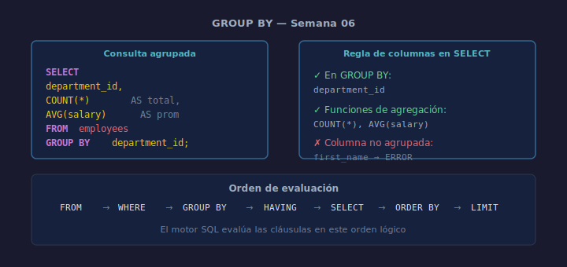

# GROUP BY

## Objetivos
- Agrupar filas por una o más columnas para calcular subtotales
- Entender qué columnas pueden aparecer en SELECT con GROUP BY
- Ordenar el resultado agrupado

## Diagrama



## 1. Sintaxis

```sql
SELECT
    department_id,
    COUNT(*)    AS total,
    AVG(salary) AS promedio
FROM   employees
GROUP BY department_id;
```

SQLite agrupa todas las filas con el mismo `department_id` y calcula
las funciones de agregación para cada grupo.

## 2. Regla de las columnas en SELECT

En el `SELECT` solo pueden aparecer:
- Columnas listadas en `GROUP BY`
- Funciones de agregación (`COUNT`, `SUM`, `AVG`, `MIN`, `MAX`)

```sql
-- ✅ Correcto
SELECT department_id, COUNT(*) FROM employees GROUP BY department_id;

-- ❌ Error — first_name no está en GROUP BY ni es función de agregación
SELECT first_name, COUNT(*) FROM employees GROUP BY department_id;
```

## 3. GROUP BY con múltiples columnas

```sql
SELECT
    department_id,
    COUNT(*) AS total
FROM   employees
GROUP BY department_id
ORDER BY total DESC;
```

## Checklist

- [ ] ¿Todas las columnas del SELECT están en GROUP BY o son funciones de agregación?
- [ ] ¿El GROUP BY agrupa por la columna con significado de negocio correcto?
- [ ] ¿Añadiste ORDER BY para que el reporte sea más legible?
- [ ] ¿Verificaste el número esperado de grupos en el resultado?

## Referencias

- https://www.sqlite.org/lang_select.html#resultset
- https://www.w3schools.com/sql/sql_groupby.asp
