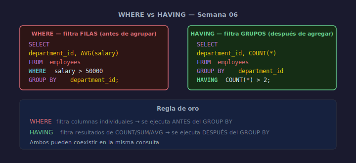

# HAVING: Filtrar Grupos

## Objetivos
- Filtrar grupos después de la agregación con `HAVING`
- Distinguir cuándo usar `WHERE` vs `HAVING`
- Combinar WHERE + GROUP BY + HAVING en una sola consulta

## Diagrama



## 1. Por qué HAVING y no WHERE

`WHERE` filtra filas individuales **antes** de agrupar.
`HAVING` filtra grupos **después** de agregar.

```sql
-- ❌ Incorrecto — WHERE no puede usar COUNT(*)
SELECT department_id, COUNT(*)
FROM   employees
WHERE  COUNT(*) > 2   -- error de sintaxis
GROUP BY department_id;

-- ✅ Correcto
SELECT department_id, COUNT(*) AS total
FROM   employees
GROUP BY department_id
HAVING COUNT(*) > 2;
```

## 2. Combinando WHERE y HAVING

```sql
-- Departamentos con más de 1 empleado activo y salario promedio > 65000
SELECT
    department_id,
    COUNT(*)    AS total,
    AVG(salary) AS promedio
FROM   employees
WHERE  salary > 0           -- filtro de fila (antes del grupo)
GROUP BY department_id
HAVING COUNT(*) > 1         -- filtro de grupo (después de agregar)
   AND AVG(salary) > 65000
ORDER BY promedio DESC;
```

## 3. Regla mnemotécnica

| Cláusula | Cuándo se evalúa | Puede filtrar |
|----------|-----------------|---------------|
| WHERE | Antes de GROUP BY | Columnas individuales |
| HAVING | Después de GROUP BY | Funciones de agregación |

## Checklist

- [ ] ¿Usaste HAVING (no WHERE) para filtrar por COUNT/SUM/AVG?
- [ ] ¿El WHERE filtra filas individuales antes del agrupamiento?
- [ ] ¿El orden de cláusulas es: WHERE → GROUP BY → HAVING → ORDER BY?
- [ ] ¿Cada condición de HAVING referencia una función de agregación?

## Referencias

- https://www.sqlite.org/lang_select.html#resultset
- https://www.w3schools.com/sql/sql_having.asp
