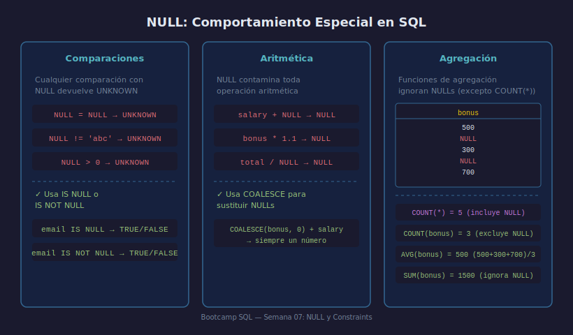

# NULL: El Valor Desconocido

## Objetivos

- Distinguir NULL de cero y cadena vacía
- Filtrar filas nulas con `IS NULL` e `IS NOT NULL`
- Predecir el comportamiento de NULL en comparaciones y aritmética

## Recurso visual



---

## 1. ¿Qué es NULL?

NULL significa **ausencia de valor conocido**. No es igual a `0`, `''` ni
`'NULL'`. Dos NULLs no son iguales entre sí.

```sql
-- Un empleado sin email registrado
INSERT INTO employees (id, first_name, email)
VALUES (10, 'Ana', NULL);
```

## 2. IS NULL e IS NOT NULL

Para comparar con NULL se usa `IS NULL`, nunca `= NULL`:

```sql
-- ✅ Correcto
SELECT * FROM employees WHERE email IS NULL;

-- ❌ Nunca devuelve filas aunque haya NULLs
SELECT * FROM employees WHERE email = NULL;
```

## 3. NULL en comparaciones

Toda comparación con NULL devuelve `UNKNOWN` (ni verdadero ni falso):

```sql
NULL = NULL    -- UNKNOWN
NULL != 'abc'  -- UNKNOWN
NULL > 0       -- UNKNOWN
```

> En `WHERE`, solo las filas que evalúan `TRUE` pasan el filtro.

## 4. NULL en aritmética

NULL "contamina" cualquier operación numérica:

```sql
SELECT salary + NULL AS resultado FROM employees;
-- resultado → NULL en todas las filas
```

## 5. NULL en agregación

Las funciones de agregación **ignoran NULL** (excepto `COUNT(*)`):

```sql
SELECT
    COUNT(*)      AS filas_totales,
    COUNT(bonus)  AS con_bonus,   -- excluye NULL
    AVG(bonus)    AS promedio     -- divide solo entre no-NULL
FROM employees;
```

---

## ✅ Checklist

- [ ] ¿Por qué `email = NULL` no devuelve resultados?
- [ ] ¿Qué devuelve `100 + NULL`?
- [ ] ¿Qué diferencia hay entre `COUNT(*)` y `COUNT(bonus)`?
- [ ] ¿Por qué `NOT IN (1, 2, NULL)` puede devolver 0 filas?

## Referencias

- https://www.sqlite.org/nulls.html
- https://www.w3schools.com/sql/sql_null_values.asp
