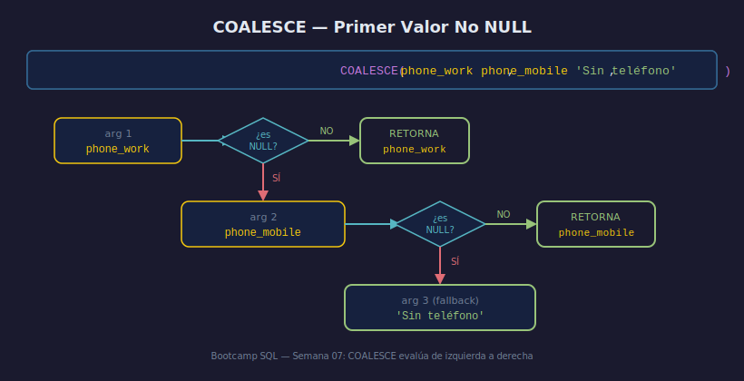

# COALESCE, IFNULL y NULLIF

## Objetivos

- Reemplazar NULL con valores de respaldo usando `COALESCE`
- Conocer `IFNULL` como atajo de SQLite
- Convertir valores específicos a NULL con `NULLIF`

## Recurso visual



---

## 1. COALESCE

Devuelve el **primer argumento no NULL** de izquierda a derecha:

```sql
SELECT
    first_name,
    COALESCE(bonus, 0) AS bonus_efectivo
FROM employees;
```

Con múltiples opciones de respaldo:

```sql
SELECT COALESCE(phone_work, phone_mobile, 'Sin teléfono') AS contacto
FROM employees;
```

## 2. IFNULL (SQLite)

Versión de dos argumentos de `COALESCE`. Es específica de SQLite:

```sql
SELECT IFNULL(email, 'sin-email@empresa.com') AS email_display
FROM employees;
```

> En PostgreSQL usa `COALESCE(email, 'sin-email@empresa.com')`.

## 3. NULLIF

Devuelve NULL si los dos argumentos son iguales; de lo contrario, el primero:

```sql
-- Prevenir división por cero
SELECT total_ventas / NULLIF(dias_laborables, 0) AS ventas_por_dia
FROM reportes;
```

```sql
-- Homogeneizar cadenas vacías como NULL
SELECT NULLIF(TRIM(phone), '') AS phone_limpio
FROM employees;
```

## 4. Comparativa

| Función | Descripción |
|---------|-------------|
| `COALESCE(a, b, c)` | Primer valor no NULL |
| `IFNULL(a, b)` | COALESCE de 2 args (SQLite) |
| `NULLIF(a, b)` | NULL si a = b, si no devuelve a |

---

## ✅ Checklist

- [ ] ¿Qué devuelve `COALESCE(NULL, NULL, 5)`?
- [ ] ¿En qué se diferencia `IFNULL` de `COALESCE`?
- [ ] ¿Para qué sirve `NULLIF(valor, 0)` en una división?
- [ ] ¿Cómo normalizarías cadenas vacías como NULL?

## Referencias

- https://www.sqlite.org/lang_corefunc.html#coalesce
- https://www.sqlite.org/lang_corefunc.html#nullif
