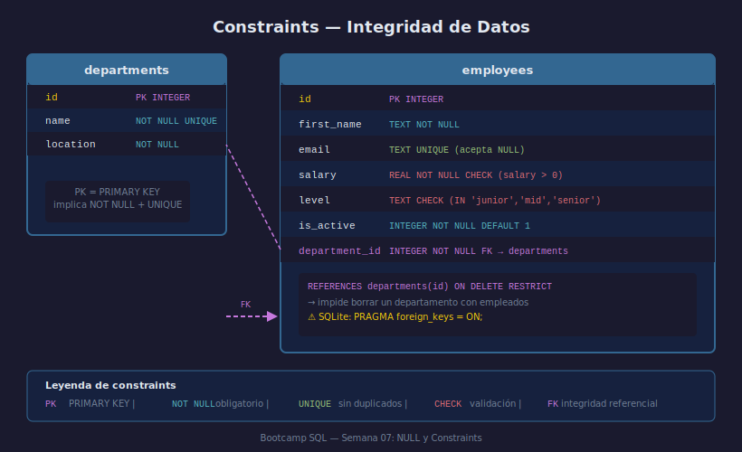

# Constraints: Integridad de Datos

## Objetivos

- Aplicar `NOT NULL`, `UNIQUE` y `CHECK` para validar columnas
- Definir `PRIMARY KEY` y `FOREIGN KEY` con acciones de cascada
- Activar la verificación de claves foráneas en SQLite

## Recurso visual



---

## 1. NOT NULL y DEFAULT

Impide valores vacíos y asigna valor automático cuando no se provee:

```sql
CREATE TABLE employees (
    id         INTEGER PRIMARY KEY,
    first_name TEXT    NOT NULL,
    is_active  INTEGER NOT NULL DEFAULT 1
);
```

## 2. UNIQUE

Garantiza que no haya duplicados en una columna o combinación:

```sql
CREATE TABLE employees (
    email TEXT UNIQUE
);

-- Unique compuesto: un empleado no puede tener el mismo turno dos veces
CREATE TABLE schedule (
    employee_id INTEGER,
    shift_date  TEXT,
    UNIQUE (employee_id, shift_date)
);
```

## 3. CHECK

Valida una condición de negocio al insertar o actualizar:

```sql
CREATE TABLE employees (
    salary REAL NOT NULL CHECK (salary > 0),
    level  TEXT CHECK (level IN ('junior', 'mid', 'senior'))
);
```

## 4. PRIMARY KEY y FOREIGN KEY

```sql
CREATE TABLE departments (
    id   INTEGER PRIMARY KEY,
    name TEXT    NOT NULL UNIQUE
);

CREATE TABLE employees (
    id            INTEGER PRIMARY KEY,
    department_id INTEGER NOT NULL
        REFERENCES departments(id) ON DELETE RESTRICT
);
```

> **SQLite requiere activar el cumplimiento de FK explícitamente:**
> ```sql
> PRAGMA foreign_keys = ON;
> ```

## 5. Opciones ON DELETE

| Acción | Comportamiento |
|--------|----------------|
| `RESTRICT` | Impide borrar si existen filas hijas |
| `CASCADE` | Borra las filas hijas automáticamente |
| `SET NULL` | Pone NULL en las referencias hijas |

---

## ✅ Checklist

- [ ] ¿Qué error lanza insertar NULL en una columna NOT NULL?
- [ ] ¿Por qué necesitas `PRAGMA foreign_keys = ON` en SQLite?
- [ ] ¿Diferencia entre `UNIQUE` de columna y `UNIQUE(col1, col2)`?
- [ ] ¿Cuándo usarías `ON DELETE CASCADE` vs `RESTRICT`?

## Referencias

- https://www.sqlite.org/lang_createtable.html#tableconstraint
- https://www.sqlite.org/foreignkeys.html
