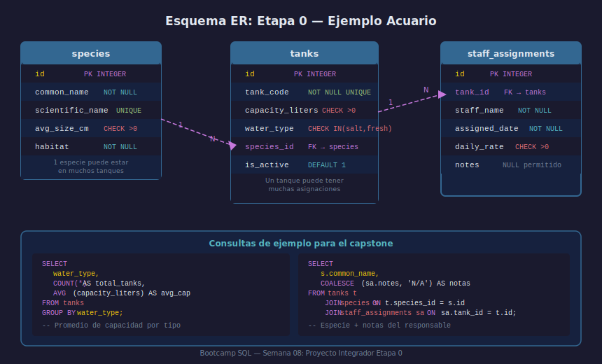

# Cheatsheet Etapa 0

## Objetivos

- Tener en un solo lugar los comandos clave de las semanas 01–07
- Usarlo como referencia durante el proyecto integrador

## Recurso visual



---

## 1. DDL — Definición de Esquema

```sql
CREATE TABLE employees (
    id            INTEGER PRIMARY KEY,
    first_name    TEXT    NOT NULL,
    email         TEXT    UNIQUE,
    salary        REAL    NOT NULL CHECK (salary > 0),
    is_active     INTEGER NOT NULL DEFAULT 1,
    department_id INTEGER NOT NULL
        REFERENCES departments(id) ON DELETE RESTRICT
);

ALTER TABLE employees ADD COLUMN phone TEXT;
DROP TABLE IF EXISTS temp_table;
```

## 2. DML — Manipulación de Datos

```sql
INSERT INTO employees (first_name, salary, department_id)
VALUES ('Ana', 55000, 1);

UPDATE employees SET salary = salary * 1.10
WHERE  id = 3;

DELETE FROM employees WHERE is_active = 0;
```

## 3. SELECT + Filtros

```sql
SELECT id, first_name, salary
FROM   employees
WHERE  salary BETWEEN 50000 AND 80000
  AND  first_name LIKE 'A%'
ORDER BY salary DESC
LIMIT 10;
```

## 4. Agregación

```sql
SELECT
    department_id,
    COUNT(*)               AS total,
    ROUND(AVG(salary), 2)  AS promedio
FROM   employees
WHERE  is_active = 1
GROUP BY department_id
HAVING COUNT(*) >= 2
ORDER BY promedio DESC;
```

## 5. NULL

```sql
SELECT first_name, COALESCE(phone, 'N/A') AS telefono
FROM   employees
WHERE  email IS NOT NULL;
```

---

## ✅ Checklist

- [ ] ¿Recuerdas la diferencia entre WHERE y HAVING?
- [ ] ¿Activaste PRAGMA foreign_keys = ON antes de crear tablas con FK?
- [ ] ¿Tus tablas usan snake_case en inglés y comentarios en español?
- [ ] ¿Tienes PRIMARY KEY en todas las tablas?

## Referencias

- https://www.sqlite.org/lang.html
- https://www.w3schools.com/sql/
