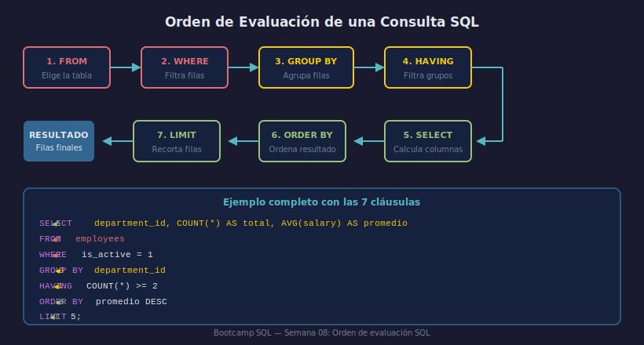

# Patrones de Consulta Frecuentes

## Objetivos

- Reconocer los 5 patrones de consulta más usados en SQL
- Combinar filtros, agregación y NULL en una sola query
- Escribir consultas analíticas de valor para el negocio

## Recurso visual



---

## 1. Reporte de totales

Cuántos y cuánto, con filtro previo:

```sql
SELECT
    department_id,
    COUNT(*)               AS total_activos,
    ROUND(AVG(salary), 2)  AS salario_promedio
FROM   employees
WHERE  is_active = 1
GROUP BY department_id
ORDER BY total_activos DESC;
```

## 2. Top N por categoría

Los N registros con mayor/menor valor en su categoría:

```sql
SELECT id, first_name, salary
FROM   employees
WHERE  department_id = 2
ORDER BY salary DESC
LIMIT 3;
```

## 3. Búsqueda por rango y patrón

```sql
SELECT *
FROM   employees
WHERE  salary BETWEEN 50000 AND 75000
  AND  first_name LIKE 'A%';
```

## 4. Valores desconocidos y substitución

```sql
SELECT
    first_name,
    COALESCE(email, 'sin-email@empresa.com') AS email_display
FROM employees
WHERE phone IS NULL;
```

## 5. Grupos con umbral mínimo (HAVING)

Solo grupos que superen un umbral de negocio:

```sql
SELECT department_id, COUNT(*) AS total
FROM   employees
GROUP BY department_id
HAVING total >= 3;
```

---

## ✅ Checklist

- [ ] ¿Recuerdas el orden: FROM → WHERE → GROUP BY → HAVING → SELECT → ORDER BY?
- [ ] ¿Cuándo usas LIMIT para proteger el rendimiento?
- [ ] ¿Usas aliases descriptivos (no a, b, c) con AS?
- [ ] ¿Tus queries de reporte tienen comentarios que expliquen el negocio?

## Referencias

- https://www.sqlite.org/lang_select.html
- https://mode.com/sql-tutorial/sql-aggregate-functions/
