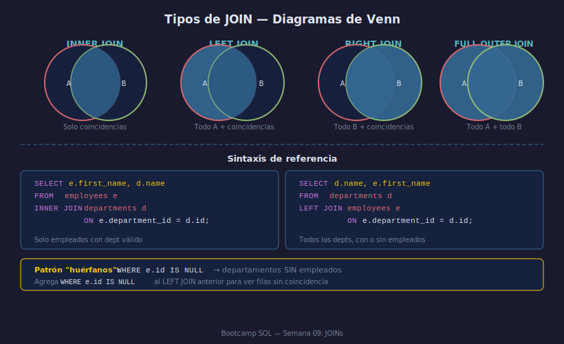

# INNER JOIN: Intersección de Tablas

## Objetivos

- Combinar filas de dos tablas usando una columna de relación
- Escribir `INNER JOIN` con la cláusula `ON` y aliases de tabla
- Entender que INNER JOIN solo devuelve filas con coincidencia en ambas tablas

## Recurso visual



---

## 1. Sintaxis básica

```sql
SELECT
    e.first_name,
    e.salary,
    d.name AS department_name
FROM employees e
INNER JOIN departments d ON e.department_id = d.id;
```

- `e` y `d` son **aliases de tabla** — obligatorios cuando hay ambigüedad
- La cláusula `ON` define la condición de unión (casi siempre FK = PK)
- Solo devuelve filas donde `e.department_id = d.id` exista en **ambas** tablas

## 2. Regla de oro: siempre califica las columnas

```sql
-- ✅ Correcto — columna calificada con alias
SELECT e.first_name, d.name FROM employees e INNER JOIN departments d ON ...

-- ❌ Ambiguo si la columna existe en dos tablas
SELECT name FROM employees INNER JOIN departments ON ...
```

## 3. JOIN entre tres tablas

```sql
SELECT
    e.first_name,
    d.name    AS department,
    l.name    AS location
FROM       employees    e
INNER JOIN departments  d ON e.department_id = d.id
INNER JOIN locations    l ON d.location_id   = l.id;
```

Cada `INNER JOIN` agrega una tabla al conjunto de datos.

## 4. INNER JOIN con filtros y agregación

```sql
SELECT
    d.name              AS department,
    COUNT(e.id)         AS total,
    AVG(e.salary)       AS promedio
FROM       departments  d
INNER JOIN employees    e ON e.department_id = d.id
WHERE  e.is_active = 1
GROUP BY d.name
ORDER BY promedio DESC;
```

---

## ✅ Checklist

- [ ] ¿Qué pasa con un empleado si su department_id no existe en departments?
- [ ] ¿Por qué siempre uso alias de tabla (e., d.) en queries con JOIN?
- [ ] ¿Es necesaria la palabra INNER? (No, `JOIN` sola = INNER JOIN)
- [ ] ¿Cuántas filas devuelve un INNER JOIN si ninguna fila coincide?

## Referencias

- https://www.sqlite.org/lang_select.html#joinclause
- https://www.w3schools.com/sql/sql_join_inner.asp
