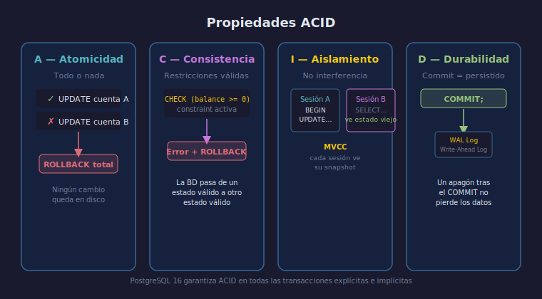

# Propiedades ACID

## Objetivo

Comprender qué garantiza una base de datos relacional
cuando se producen fallos o accesos simultáneos.

## Diagrama



## 1. ¿Qué es una transacción?

Una **transacción** es un bloque de sentencias que se ejecuta
como una unidad indivisible.

```sql
-- Transferencia bancaria: dos operaciones, un resultado
BEGIN;
    UPDATE accounts SET balance = balance - 500 WHERE id = 1;
    UPDATE accounts SET balance = balance + 500 WHERE id = 2;
COMMIT;
```

Si algo falla entre las dos sentencias, `ROLLBACK` deja
la base de datos como si nada hubiera ocurrido.

## 2. A — Atomicidad

> "Todo o nada."

Las sentencias de una transacción se consolidan juntas o
se descarten juntas. No existe estado intermedio visible.

## 3. C — Consistencia

> "Las restricciones siempre válidas."

Si una `CHECK`, `FOREIGN KEY` o `NOT NULL` se viola,
la transacción es rechazada al completo.

```sql
-- balance >= 0 está definida con CHECK
-- Si el resultado fuera negativo, PostgreSQL lanza error
-- y la transacción se cancela automáticamente
UPDATE accounts SET balance = balance - 9999 WHERE id = 1;
```

## 4. I — Aislamiento

> "Las transacciones concurrentes no se interfieren."

PostgreSQL usa **MVCC** (Multi-Version Concurrency Control):
cada transacción ve una "foto" consistente de los datos
mientras otra transacción aún está en curso.

## 5. D — Durabilidad

> "Un commit persiste ante cualquier fallo."

Una vez que `COMMIT` responde exitosamente, el cambio está
en disco. Un apagón posterior no lo pierde.

## Checklist de comprensión

1. ¿Cuál propiedad impide que una transferencia deje un cuenta
   debitada sin acreditar la otra?
2. ¿Qué diferencia hay entre ROLLBACK explícito y el rollback
   que hace PostgreSQL por un error de constraint?
3. ¿Qué propiedad garantiza que dos sesiones simultáneas
   no lean datos a medio modificar?
4. ¿Qué ocurre con un COMMIT si el servidor se cae 1 ms después?

## Referencias

- [PostgreSQL — Transactions](https://www.postgresql.org/docs/16/tutorial-transactions.html)
- [PostgreSQL — MVCC](https://www.postgresql.org/docs/16/mvcc-intro.html)
