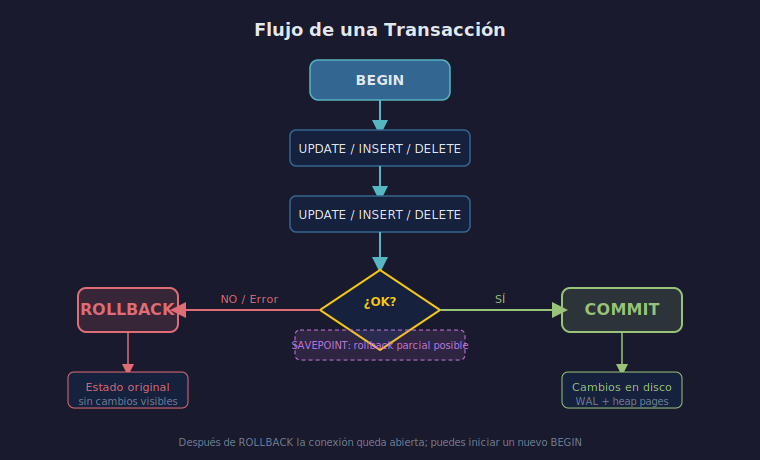

# BEGIN, COMMIT y ROLLBACK

## Objetivo

Controlar explícitamente cuándo se confirman o cancelan
los cambios en la base de datos.

## Diagrama



## 1. Por defecto: autocommit

Sin `BEGIN`, cada sentencia es su propio COMMIT implícito.

```sql
-- Sin transacción explícita, este DELETE es inmediato e irrecuperable
DELETE FROM accounts WHERE id = 5;
```

## 2. BEGIN — abrir una transacción

```sql
BEGIN;
-- A partir de aquí, los cambios son temporales
UPDATE accounts SET balance = balance - 200 WHERE id = 1;
UPDATE accounts SET balance = balance + 200 WHERE id = 3;
```

> `START TRANSACTION` es equivalente a `BEGIN`.

## 3. COMMIT — confirmar

```sql
-- Si todo fue correcto, se persisten los cambios
COMMIT;
```

Después del COMMIT, cualquier sesión verá los nuevos saldos.

## 4. ROLLBACK — cancelar

```sql
BEGIN;
UPDATE accounts SET balance = balance - 1000 WHERE id = 1;
-- Detectamos un error o cambiamos de opinión
ROLLBACK;
-- La cuenta queda con su saldo original
```

## 5. Error dentro de una transacción

Cuando PostgreSQL encuentra un error dentro de un bloque
abierto con `BEGIN`, el bloque queda en estado de **error**.
Todas las sentencias siguientes son ignoradas hasta que
se haga `ROLLBACK`.

```sql
BEGIN;
UPDATE accounts SET balance = balance - 50 WHERE id = 1;
-- Esta sentencia lanza error (balance quedaría negativo)
UPDATE accounts SET balance = balance - 99999 WHERE id = 1;
-- Esta línea NO se ejecutará aunque no tenga error
SELECT * FROM accounts;
-- Debes cerrar con ROLLBACK antes de poder continuar
ROLLBACK;
```

## Checklist de comprensión

1. ¿Qué pasa si cierras la conexión sin COMMIT?
2. ¿Puede un ROLLBACK deshacer un `CREATE TABLE` que estaba
   dentro del bloque?
3. ¿Por qué se dice que PostgreSQL "aborta" la transacción
   en lugar de solo ignorar el error?
4. ¿Cuál es la diferencia entre `COMMIT` y `END`?

## Referencias

- [PostgreSQL — BEGIN](https://www.postgresql.org/docs/16/sql-begin.html)
- [PostgreSQL — COMMIT](https://www.postgresql.org/docs/16/sql-commit.html)
- [PostgreSQL — ROLLBACK](https://www.postgresql.org/docs/16/sql-rollback.html)
