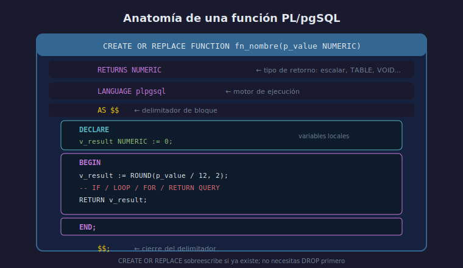

# CREATE FUNCTION en PL/pgSQL

## Objetivo

Crear funciones reutilizables que encapsulan lógica SQL
y devuelven valores al llamarlas desde una consulta.

## Diagrama



## 1. Estructura mínima

```sql
CREATE OR REPLACE FUNCTION fn_nombre(parametro TIPO)
RETURNS TIPO_RETORNO
LANGUAGE plpgsql
AS $$
DECLARE
    -- variables locales (opcional)
BEGIN
    -- lógica
    RETURN valor;
END;
$$;
```

## 2. Función escalar

Retorna un único valor. Se usa en cualquier expresión SQL.

```sql
CREATE OR REPLACE FUNCTION fn_monthly_salary(annual NUMERIC)
RETURNS NUMERIC
LANGUAGE plpgsql
AS $$
BEGIN
    RETURN ROUND(annual / 12, 2);
END;
$$;

-- Llamada desde SELECT
SELECT owner, fn_monthly_salary(balance) AS monthly
FROM accounts;
```

## 3. RETURNS TABLE

Retorna múltiples filas y columnas, equivalente a una vista dinámica.

```sql
CREATE OR REPLACE FUNCTION fn_accounts_above(min_balance NUMERIC)
RETURNS TABLE(id INT, owner TEXT, balance NUMERIC)
LANGUAGE plpgsql
AS $$
BEGIN
    RETURN QUERY
        SELECT a.id, a.owner, a.balance
        FROM accounts a
        WHERE a.balance >= min_balance
        ORDER BY a.balance DESC;
END;
$$;

-- Llamada como tabla
SELECT * FROM fn_accounts_above(1000);
```

## 4. Eliminar una función

```sql
DROP FUNCTION IF EXISTS fn_nombre(tipo_param);
```

> La firma (nombre + tipos de parámetros) identifica la función.

## Checklist de comprensión

1. ¿Qué diferencia hay entre `RETURNS NUMERIC` y `RETURNS TABLE`?
2. ¿Por qué se usa `RETURN QUERY` en lugar de solo `RETURN`?
3. ¿Puedes llamar a una función escalar en una cláusula `WHERE`?
4. ¿Qué pasa si creas una función con el mismo nombre pero
   distintos tipos de parámetro?

## Referencias

- [PostgreSQL — PL/pgSQL Functions](https://www.postgresql.org/docs/16/plpgsql-declarations.html)
- [PostgreSQL — RETURNS TABLE](https://www.postgresql.org/docs/16/sql-createfunction.html)
