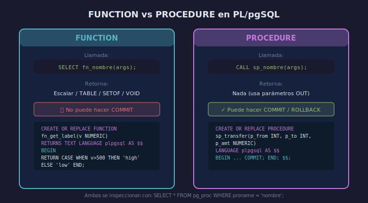

# CREATE PROCEDURE y manejo de excepciones

## Objetivo

Implementar procedimientos almacenados que encapsulan transacciones
y capturar errores en tiempo de ejecución con bloques `EXCEPTION`.

## Diagrama



## 1. PROCEDURE vs FUNCTION

| | FUNCTION | PROCEDURE |
|---|---|---|
| Retorna valor | Sí | No (usa parámetros OUT) |
| Gestiona transacciones | No | Sí (puede hacer COMMIT/ROLLBACK) |
| Se llama con | `SELECT fn_()` | `CALL sp_()` |

## 2. Sintaxis de PROCEDURE

```sql
CREATE OR REPLACE PROCEDURE sp_transfer(
    p_from   INT,
    p_to     INT,
    p_amount NUMERIC
)
LANGUAGE plpgsql
AS $$
BEGIN
    UPDATE accounts SET balance = balance - p_amount
    WHERE id = p_from;
    UPDATE accounts SET balance = balance + p_amount
    WHERE id = p_to;
    COMMIT;
END;
$$;

-- Llamada
CALL sp_transfer(1, 2, 100);
```

## 3. Manejo de excepciones

El bloque `EXCEPTION` va después del cuerpo principal, dentro de `BEGIN … END`:

```sql
CREATE OR REPLACE PROCEDURE sp_safe_transfer(
    p_from   INT,
    p_to     INT,
    p_amount NUMERIC
)
LANGUAGE plpgsql
AS $$
BEGIN
    UPDATE accounts SET balance = balance - p_amount
    WHERE id = p_from;
    UPDATE accounts SET balance = balance + p_amount
    WHERE id = p_to;
EXCEPTION
    WHEN check_violation THEN
        RAISE EXCEPTION 'Saldo insuficiente en cuenta %', p_from;
    WHEN OTHERS THEN
        RAISE EXCEPTION 'Error inesperado: %', SQLERRM;
END;
$$;
```

## 4. Bloque DO (anónimo)

Para ejecutar PL/pgSQL sin crear un objeto persistente:

```sql
DO $$
DECLARE
    v_count INT;
BEGIN
    SELECT COUNT(*) INTO v_count FROM accounts;
    RAISE NOTICE 'Total de cuentas: %', v_count;
END;
$$;
```

## Checklist de comprensión

1. ¿Por qué un PROCEDURE puede hacer COMMIT y una FUNCTION no?
2. ¿Qué contiene `SQLERRM`? ¿Y `SQLSTATE`?
3. ¿Qué ocurre si no hay bloque `EXCEPTION` y se lanza un error?
4. ¿Para qué sirve `WHEN OTHERS`? ¿Es buena práctica usarlo siempre?

## Referencias

- [PostgreSQL — PL/pgSQL Errors and Messages](https://www.postgresql.org/docs/16/plpgsql-errors-and-messages.html)
- [PostgreSQL — CREATE PROCEDURE](https://www.postgresql.org/docs/16/sql-createprocedure.html)
