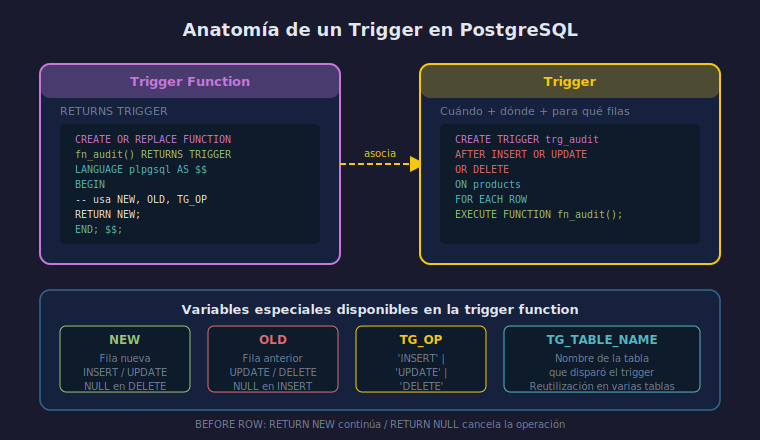

# Qué es un trigger y sus tipos

## Objetivo

Entender qué es un trigger, cuándo se activa
y cuáles son sus variantes en PostgreSQL 16.

## Diagrama



## 1. ¿Qué es un trigger?

Un **trigger** es un objeto de base de datos que ejecuta
una función automáticamente en respuesta a un evento
sobre una tabla o vista.

```
Evento (INSERT/UPDATE/DELETE) → Trigger → Trigger Function
```

## 2. Partes de un trigger

Un trigger se compone de dos objetos separados:

1. **Trigger function** — función PL/pgSQL con `RETURNS TRIGGER`
2. **Trigger** — define cuándo y en qué tabla se dispara la función

```sql
-- Paso 1: crear la función
CREATE OR REPLACE FUNCTION fn_audit_trigger()
RETURNS TRIGGER
LANGUAGE plpgsql
AS $$
BEGIN
    -- lógica aquí
    RETURN NEW;
END;
$$;

-- Paso 2: crear el trigger que la usa
CREATE TRIGGER trg_audit
AFTER INSERT OR UPDATE OR DELETE ON products
FOR EACH ROW EXECUTE FUNCTION fn_audit_trigger();
```

## 3. Tipos por momento

| Momento | Descripción |
|---------|-------------|
| `BEFORE` | Se ejecuta antes de modificar la fila |
| `AFTER` | Se ejecuta después de modificar la fila |
| `INSTEAD OF` | Solo en vistas; reemplaza la operación |

## 4. Tipos por granularidad

| Granularidad | Descripción |
|--------------|-------------|
| `FOR EACH ROW` | Se dispara una vez **por fila** afectada |
| `FOR EACH STATEMENT` | Se dispara **una vez** por sentencia |

## Checklist de comprensión

1. ¿Qué diferencia hay entre la trigger function y el trigger?
2. ¿Para qué sirve `INSTEAD OF` y en qué objetos se usa?
3. Si un UPDATE afecta 5 filas, ¿cuántas veces se ejecuta
   un trigger `FOR EACH ROW`?
4. ¿Puedes tener múltiples triggers en la misma tabla
   para el mismo evento?

## Referencias

- [PostgreSQL — Triggers](https://www.postgresql.org/docs/16/triggers.html)
- [PostgreSQL — CREATE TRIGGER](https://www.postgresql.org/docs/16/sql-createtrigger.html)
