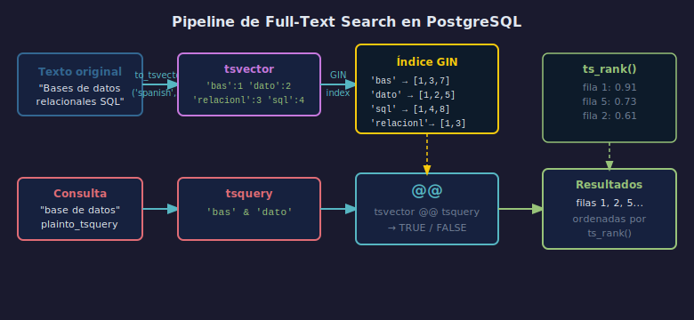

# 01 — tsvector y tsquery

## Objetivos

1. Entender qué almacena un `tsvector` y cómo se diferencia de `TEXT`.
2. Construir `tsquery` con `to_tsquery()` y `plainto_tsquery()`.
3. Usar el operador `@@` para evaluar si un documento contiene una búsqueda.

## Diagrama



---

## 1. tsvector — el documento indexado

`tsvector` convierte texto a una lista de **lexemas** normalizados
(sin stopwords, en forma canónica).

```sql
-- Texto → tsvector
SELECT to_tsvector('spanish',
    'Los estudiantes aprendieron a crear bases de datos relacionales');

-- Resultado:
-- 'aprend':3 'bas':7 'cre':5 'dato':8 'estudi':2 'relacionl':9
-- Las stopwords (los, a, de) se eliminan
```

---

## 2. tsquery — la consulta de búsqueda

```sql
-- Operadores: & (AND), | (OR), ! (NOT), <-> (seguido por)
SELECT to_tsquery('spanish', 'datos & relacionales');
SELECT to_tsquery('spanish', 'base | tabla');
SELECT to_tsquery('spanish', '!nulo');

-- plainto_tsquery: texto libre → AND implícito entre palabras
SELECT plainto_tsquery('spanish', 'base de datos relacionales');
-- Resultado: 'bas' & 'dato' & 'relacionl'
```

---

## 3. Operador @@ — coincidencia

```sql
SELECT 'bases de datos'::TEXT,
       to_tsvector('spanish', 'bases de datos') @@ to_tsquery('spanish', 'dato');
-- TRUE porque 'dato' es lexema de 'datos'

-- En una tabla
SELECT title
FROM articles
WHERE to_tsvector('spanish', body) @@ plainto_tsquery('spanish', 'base datos');
```

---

## 4. Checklist

- ¿Qué son los stopwords y por qué se eliminan del `tsvector`?
- ¿Cuál es la diferencia entre `to_tsquery` y `plainto_tsquery`?
- ¿Qué hace el operador `<->` en una `tsquery`?
- ¿Por qué `to_tsvector` necesita configuración de idioma?

## Referencias

- https://www.postgresql.org/docs/16/textsearch-intro.html
- https://www.postgresql.org/docs/16/functions-textsearch.html
