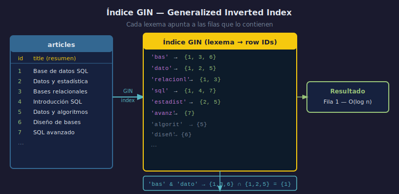

# 02 — Índice GIN y el operador @@

## Objetivos

1. Crear una columna `tsvector` generada y un índice GIN sobre ella.
2. Entender por qué GIN es el tipo de índice correcto para FTS.
3. Escribir búsquedas que usen el índice en lugar de un escaneo completo.

## Diagrama



---

## 1. Columna tsvector generada

En lugar de calcular `to_tsvector` en cada consulta,
se puede almacenar en una columna generada:

```sql
ALTER TABLE articles
ADD COLUMN search_vector TSVECTOR
    GENERATED ALWAYS AS (
        to_tsvector('spanish', COALESCE(title, '') || ' ' || COALESCE(body, ''))
    ) STORED;
```

> Con `GENERATED ALWAYS AS ... STORED`, PostgreSQL actualiza la columna
> automáticamente en `INSERT` y `UPDATE`.

---

## 2. Índice GIN

GIN (Generalized Inverted Index) mapea cada lexema a las filas que lo contienen:

```sql
CREATE INDEX idx_articles_fts
    ON articles USING GIN (search_vector);
```

Sin índice: PostgreSQL lee y calcula `to_tsvector` para cada fila (seq scan).
Con GIN: acceso directo al conjunto de filas que contienen el lexema.

---

## 3. Búsqueda que usa el índice

```sql
-- La columna ya tiene el tsvector precalculado
SELECT id, title
FROM articles
WHERE search_vector @@ plainto_tsquery('spanish', 'base datos')
ORDER BY ts_rank(search_vector, plainto_tsquery('spanish', 'base datos')) DESC;
```

> Para que el índice GIN se use, la columna del lado izquierdo de `@@`
> debe ser del tipo `tsvector`.

---

## 4. Checklist

- ¿Por qué GIN es mejor que B-tree para búsqueda de texto completo?
- ¿Qué significa `STORED` en una columna generada?
- ¿Qué pasa si cambio el cuerpo de un artículo — se actualiza `search_vector`?
- ¿Puede un índice GIN cubrir múltiples columnas de texto combinadas?

## Referencias

- https://www.postgresql.org/docs/16/textsearch-indexes.html
- https://www.postgresql.org/docs/16/gin-intro.html
